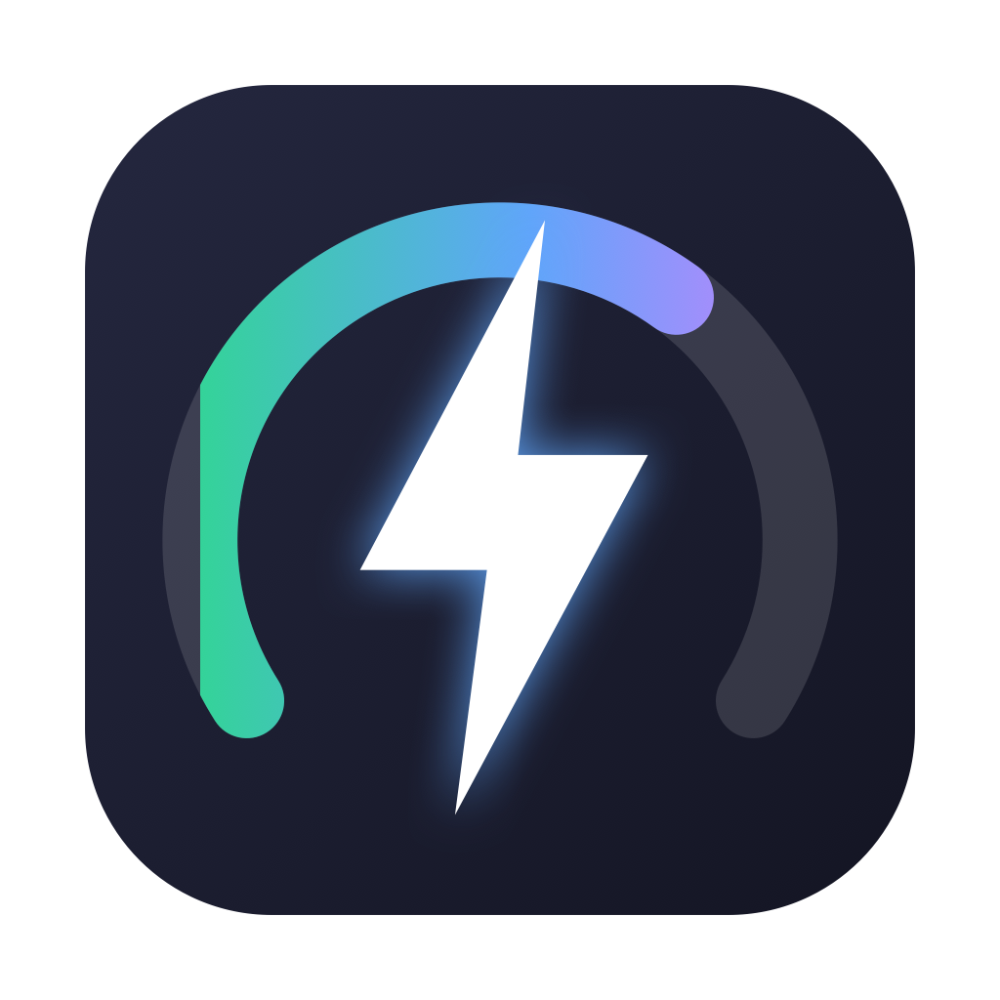
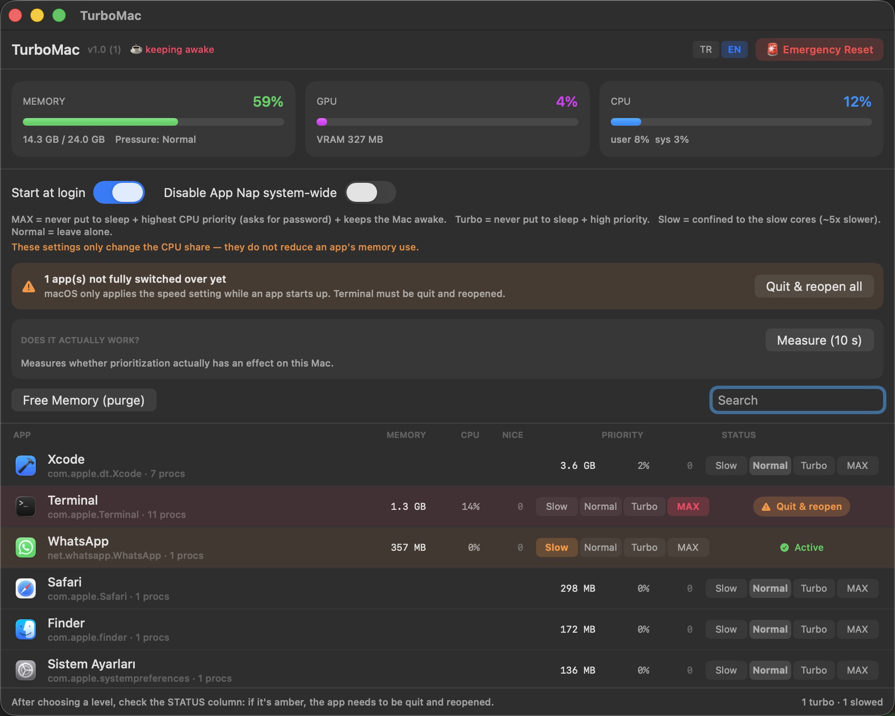

<div align="center">



# TurboMac

**macOS'un, beklediğin uygulamayı kısmasına izin verme.**

Canlı bellek, GPU ve CPU kullanımını gösteren; uygulamaları tek tek bir hız
sınıfına sabitlemene izin veren küçük bir menü çubuğu aracı. Böylece diğer
masaüstünde dönen uzun iş, tam hızda çalışmaya devam eder.

[](https://www.apple.com/tr/macos/)
[](https://swift.org)
[](LICENSE)



</div>

---

## Sorun

Uzun bir derleme, bir model indirmesi, bir yapay zekâ ajanı başlatıyorsun —
dakikalar sürecek bir şey. O çalışırken başka bir işe bakmak için başka bir
masaüstüne geçiyorsun.

Geri döndüğünde neredeyse hiç ilerlememiş oluyor.

Bu ne senin kuruntun ne de ısınmadan kaynaklı bir kısıtlama. macOS'ta **App Nap**
denen bir pil tasarrufu özelliği var. Bir uygulamanın pencereleri artık
görünmüyorsa — başka bir Space'e geçtiğin, uygulamayı küçülttüğün ya da üstünü
başka bir pencereyle kapattığın için — macOS "nasılsa kimse bakmıyor" diye karar
verip onu kısmaya başlıyor:

- aldığı CPU süresini azaltıyor
- zamanlayıcılarını topluyor; saniyede 60 kez çalışan iş, saniyede bir kez
  çalışır hale geliyor
- disk ve ağ işlerini arka plan öncelik katmanına düşürüyor

Boşta duran bir sohbet uygulaması için harika. Beklediğin iş için felaket.

Activity Monitor sana yavaşlamayı gösterir. Durdurmak için hiçbir şey sunmaz.

## TurboMac ne yapıyor

TurboMac menü çubuğuna bir yüzde, arkasına da uygulama başına bir hız anahtarı
koyuyor.

| Seviye | Ne yapıyor |
|:--|:--|
| **MAX** | App Nap kapalı · en yüksek CPU önceliği (`nice −20`, şifreni ister) · aktifken Mac'i uyanık tutar |
| **Turbo** | App Nap kapalı · yüksek CPU önceliği (`nice −10`) |
| **Normal** | Hiçbir şey. Kural konmamış uygulamalara asla dokunulmaz. |
| **Kıs** | Uygulamayı verimlilik çekirdeklerine hapseder — yaklaşık **5 kat yavaş**. Arka planda sadece dönmesi yeten işler için. |

Kurallar paket kimliği (bundle identifier) bazında saklanır; uygulamayı
kapatsan, TurboMac'i kapatsan, Mac'i yeniden başlatsan da kalır.

Her şeye menü çubuğu açılır panelinden de ulaşılır: canlı göstergeler, aktif
kuralların, en çok bellek yiyen beş uygulama ve acil durum sıfırlama.

## Ne işe yaradığı konusunda dürüst

Çoğu "Mac hızlandırıcı" uygulaması, ölçülebilir hiçbir şey yapmayan düğmelerle
gelir. Bu uygulama bir ölçüm aracıyla geliyor, böylece README'ye güvenmek zorunda
değilsin.

**Ölç (10 sn)** düğmesine bas; TurboMac *senin* makinende CPU yoğun bir döngüyü
üç farklı şekilde çalıştırıp sayıları söylüyor. Bir M4'te (macOS 26):

| Çalıştırma | 3 saniyedeki tur sayısı |
|:--|--:|
| Normal | 34.054 |
| Arka plan politikasıyla başlatılmış | 5.466 |
| **Fark** | **6,2 kat yavaş** |

"Kıs" seviyesinin sana gerçekten kazandırdığı şey bu — iddia edilmiş değil,
ölçülmüş.

Aynı ölçüm, uygulamanın çalışma şeklini değiştiren bir şeyi de ortaya çıkardı:

> **macOS bir sürecin hız sınıfını yalnızca o süreç başlarken atıyor.**
> Zaten çalışan bir sürece politika uygulamak "başarılı" döner ve kesinlikle
> hiçbir şey yapmaz — o sürecin içinde açılan yeni bir thread bile kısık kalır
> (16.251'e karşı 6.188 tur).

Bu yüzden TurboMac, tıkladığın anda kuralın geçerli olduğunu **numarasını
yapmıyor**. Her satır gerçek durumunu gösteriyor:

- 🟢 **Aktif** — ayar tam olarak uygulanmış
- 🟠 **Kapat ve aç** — tıklanabilir; ayarın gerçek olması için uygulamanın
  yeniden başlaması gerekiyor

Hangisinin hangisi olduğunu, kuralı ne zaman koyduğunla uygulamanın gerçek açılış
saatini karşılaştırarak biliyor. Üstteki şerit, hâlâ bekleyen her şeyi yeniden
başlatmayı teklif ediyor; onay penceresi de sadece "yeniden başlat" diye dayatmak
yerine bunun neden gerektiğini düz bir dille açıklıyor.

TurboMac hiçbir uygulamayı asla zorla kapatmaz. Bir uygulama kapanmayı
reddederse — genellikle kaydedilmemiş bir işi sorduğu için — yeniden başlatmadan
vazgeçilir ve sana ne olduğu söylenir. İşin asla risk altına girmez.

## Acil Durum Sıfırlama

Sağ üstte tek bir kırmızı düğme. Onay istiyor, sonra Mac'ini tam olarak eski
haline döndürüyor:

- bütün kuralları siler
- uygulama bazlı ve sistem geneli her App Nap ayarını geri alır
- değiştirdiği bütün süreç önceliklerini 0'a çeker
- uyanık tutma kilidini bırakır
- ayarların anında geçerli olması için tercih servisini yeniler

Geride hiçbir şey kalmaz, aranacak bir yapılandırma dosyası yoktur.

## Kurulum

**İndir** — en güncel `.app` dosyasını
[Releases](https://github.com/tunaarikaya/TurboMac/releases) sayfasından al,
`/Applications` klasörüne sürükle ve aç.

Uygulama ad-hoc imzalı, notarize edilmemiş. İlk açılışta macOS reddedecek;
uygulamaya sağ tıkla → **Aç**, sonra onayla. Sadece bir kez.

**Kaynaktan derle** — bağımlılık yok, kurulacak bir şey yok:

```bash
git clone https://github.com/tunaarikaya/TurboMac.git
cd TurboMac
./build-cli.sh          # → ~/Applications/TurboMac.app
```

Ya da `TurboMac.xcodeproj` dosyasını açıp ⌘R'ye bas.

macOS 15 veya üstü gerekir. Universal, ama Apple silicon üzerinde geliştirildi ve
ölçüldü.

## Açılışta başlatma

Paneldeki **Açılışta başlat** anahtarını aç. TurboMac,
`~/Library/LaunchAgents/com.tuna.turbomac.plist` dosyasını kurulu kopyayı
gösterecek şekilde yazıyor.

Xcode'un DerivedData klasöründen bir debug derlemesi çalıştırırken bunu açmayı
bilerek reddediyor — o klasör temizlendiğinde elinde bozuk bir açılış girdisi
kalırdı.

## İzinler

TurboMac yönetici şifreni yalnızca iki durumda, her tetiklediğinde istiyor:

- **MAX** — negatif bir `nice` değerini yalnızca `root` atayabilir
- **Belleği Boşalt (purge)** — `/usr/sbin/purge` root gerektirir

Geri kalan her şey senin yetkinle çalışır. Yardımcı bir araç kurulmaz, root
olarak çalışan bir servis yoktur, şifre hiçbir yerde saklanmaz. Yetki gerektiren
her işlem standart macOS yetkilendirme penceresinden geçer.

## Yapamadıkları

Sınırlar konusunda açık olmak gerekirse:

- **Bir uygulamanın bellek kullanımını azaltamaz.** Hız seviyeleri CPU payını
  değiştirir, başka bir şeyi değil. macOS başka bir uygulamanın belleğini geri
  almak için bir API sunmuyor. Seçeneklerin uygulamayı kapatmak ya da sistem
  geneli `purge` kullanmak.
- **GPU'yu önceliklendiremez.** macOS süreç başına GPU zamanlaması sunmuyor. GPU
  kullanımı gösterilir, kontrol edilmez.
- **Çalışan bir süreci yeniden ayarlayamaz.** Yukarıya bak — bu bir macOS
  kısıtı, yeniden başlatmaların sebebi de bu.
- **High Power Mode çoğu Mac'te yok.** Yalnızca belirli üst seviye MacBook Pro
  modellerinde bulunuyor; bu yüzden TurboMac senin makinende hiçbir şey
  yapmayacak bir anahtar sunmuyor.

## Nasıl yazıldı

Düz SwiftUI. Üçüncü parti bağımlılık yok, paket yöneticisi yok, Xcode dışında
derleme sistemi yok. 17 dosyada yaklaşık 1.100 satır.

```
TurboMac/
├── Core/
│   ├── Shell.swift          Süreç çalıştırma, yetkili komutlar
│   └── Lang.swift           Dil enum'ı
├── System/
│   ├── SystemStats.swift    RAM / CPU / GPU örnekleme (mach, sysctl, ioreg)
│   └── ProcessTable.swift   ps ayrıştırma, süreç ağacı gezme
├── Engine/
│   ├── Priority.swift       Dört hız seviyesi
│   ├── Policy.swift         App Nap, nice, purge
│   ├── Caffeine.swift       MAX için uyanık tutma kilidi
│   ├── Benchmark.swift      "gerçekten işe yarıyor mu" ölçümü
│   ├── LoginItem.swift      LaunchAgent yönetimi
│   └── Relaunch.swift       Uygulamayı politika altında yeniden başlatma
├── Models/AppRow.swift
├── UI/                      Components, BenchCard, MenuPanel, ContentView
├── Store.swift              Durum ve aksiyonlar
└── TurboMacApp.swift        Giriş noktası, tek-kopya kilidi
```

Kaynağı okuyacaksan bilmeye değer iki tasarım detayı:

**Süreçler değil, süreç ağaçları.** Chrome, Electron uygulamaları ve terminaller
asıl işi yardımcı süreçlerde yapıyor. Kuralı yalnızca ana sürece uygulamak
hiçbir işe yaramazdı; bu yüzden TurboMac bütün `ppid` ağacını gezip seviyeyi her
alt sürece uyguluyor. Bellek ve CPU rakamlarının süreç başına bakan bir
görünümden daha yüksek — ve daha dürüst — olmasının sebebi de bu.

**Okunmayan pipe yok.** `sh()`, stderr'i okunmayan bir `Pipe` yerine
`/dev/null`'a gönderiyor. Okunmayan bir pipe 64 KB biriktiğinde alt süreci
kilitler ve bu arayüzü dondururdu. stderr'in gerçekten önemli olduğu yerde —
şifre penceresini iptal ettiğini anlamak için — `shFull()` iki pipe'ı da paralel
boşaltıyor.

## Katkı

Issue ve pull request'lere açığım. Yeni bir optimizasyon öneriyorsan, lütfen
gerçekten bir şey yaptığını gösteren bir ölçüm ekle — bu uygulamanın bütün
mantığı bu.

Arayüz İngilizce ve Türkçe geliyor, üstteki düğmeden değiştirilebiliyor. Metinler
kod içinde `store.t("türkçe", "english")` çağrıları; yeni bir dil eklemek `Lang`
enum'ını genişletmek demek.

## Lisans

MIT — [LICENSE](LICENSE) dosyasına bak.

---

<div align="center">
<sub>For English documentation: <a href="README.md">README.md</a></sub>
</div>
